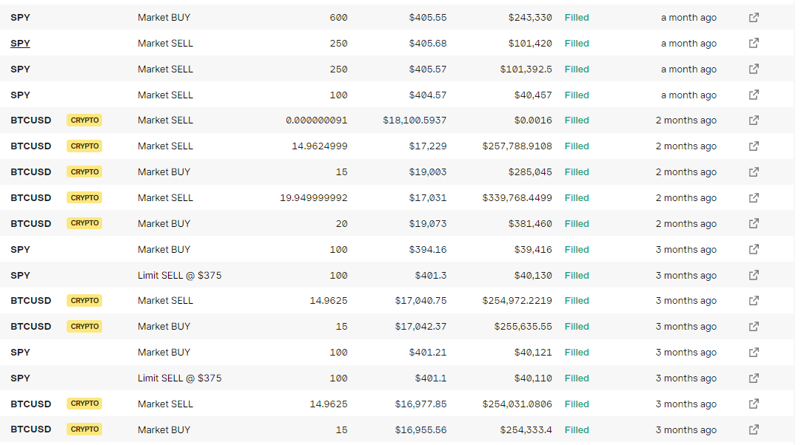
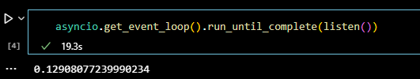

# Trading-Bot-and-Sentiment-Analysis

---
## Project Overview:
This project is a mixture of two main coding projects that each have two different methods of getting essentially to the same end goal. There are three total notebooks. Two notebooks are intended to be a news trading bot that takes long/short positions on the market based on macroeconomic news. This includes the release of monthly CPI, fed FOMC decisions for rate hikes/cuts and also nonfarm payroll data. The first implementation of this is under "twitter_trade". This makes use of the twitter API as well as a known account that posts economic data using a bloomberg terminal. The data is then drawn from those tweets and used to make decisions to long/short the market.
>
The second file that trades news is called "websocket_trade". This notebook does the exact same thing that the first trading bot does, but the implementation allows it to be faster. This was a change I made to the code throughout the time that I was working out how to do this. Ultimately there are tons of people trying to bot this news and what success comes down to is who can be the first to get their trade in. I found that using a websocket was faster - due to the twitter API having a delay of a few seconds. 
> 
The third notebook is used to do sentiment analysis on tweets from twitter. I used the twitter API to pull hundreds of tweet with the keyword "Bitcoin" in it. After this I cleaned up the tweets and then performed sentiment analysis on them. The first attempt uses 'Textblob' a natural language processing library that can perform sentiment analysis on text. 

---
## Usage and Installation:
In order to use the code from these notebooks you would need to download the proper libraries for the imports. On top of this you would need to create a twitter account and get twitter API keys as well as setup your twitter account on twitters development website. Once you do this you can authorize pulling tweets with your own account and go from there. You would also need to familiarize yourself with websockets, download the library, and find a website that has a live websocket feed or use the websocket that I used.

---
## Results and Summary:

>
Above you can see all the trades that were made throughout the few months that I was working on the trading bot. Many of these trades were taken for different reasons - some for CPI some for rate hikes, and some for nonfarm payroll data. Overall I ended up losing money, but this was because I needed to test to make sure the code was working. I would intentionally make the trade parameters very tight to what the expected economic data was going to be - meaning I was taking on more risk because the bot would trade regardless of how close the data came in to expectations.
>

>
Here you can see a timed trade using the twitter bot. From gathering the tweet from online to making the trade - it took about .13 seconds.
>

>
Here is the websocket timing for the same trade. .129 seconds - slighly faster. But also faster than you think because it actually came in much quicker with the data. The physical execution of the trade itself took about the same time, but the trade was done a second or two earlier by the websocket.
>
Finally, here is the best trade from all of them- which was a trade for nonfarm payroll data where I took a short position on the SPX:
